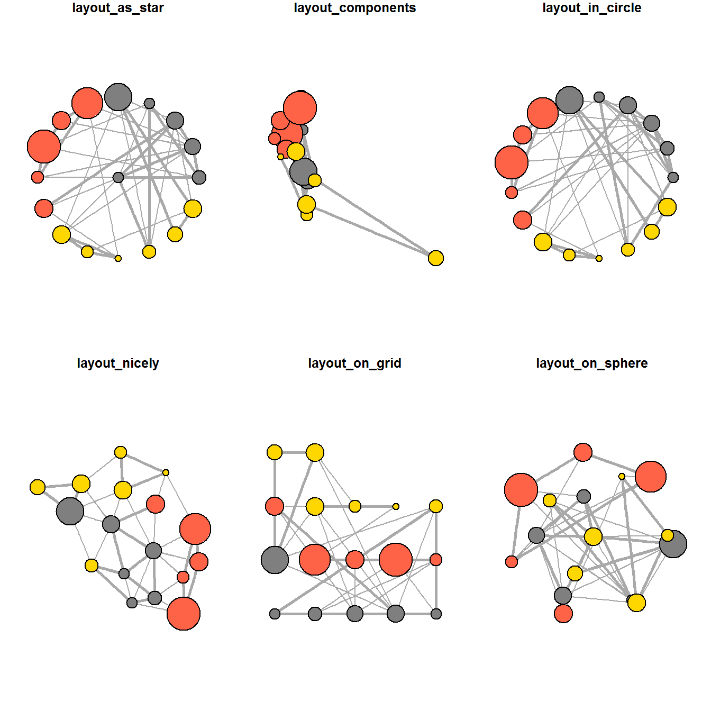

## Overview

In this exercise, we will:

-   create graph object data.frames and manipulate them using appropriate functions of **dplyr**, **lubridate**, and **tidygraph**,
-   build network graph visualisation using appropriate functions of **ggraph**,
-   compute network geometrics using **tidygraph**,
-   build advanced graph visualisation by incorporating the network geometrics, and
-   build interactive network visualisation using **visNetwork**.

## Loading Data

We will be using the following network data modelling and visualisation packages:

-   [**igraph**](https://r.igraph.org/) for the analysis of graphs or networks;
-   [**tidygraph**](https://tidygraph.data-imaginist.com/) provides a tidy API for graph/network manipulation;
-   [**ggraph**](https://ggraph.data-imaginist.com/) is an extension of **ggplot2** aimed at supporting relational data structures such as networks, graphs, and trees;
-   [**visNetwork**](https://datastorm-open.github.io/visNetwork/) for network visualization;
-   [**graphlayouts**](https://github.com/schochastics/graphlayouts) to implement several new layout algorithms to visualize networks not in **igraph**;
-   [**lubridate**](https://lubridate.tidyverse.org/) part of **tidyverse**, makes it easier to do the things R does with date-times and possible to do the things R does not;
-   [**clock**](https://clock.r-lib.org/) for working with date-times;

And as usual:

-   tidyverse, a family of R packages for data science processes.

```{r}
pacman::p_load(igraph, tidygraph, ggraph, visNetwork, graphlayouts,
               lubridate, clock,
               tidyverse)
```

In this exercise, we will be using two datasets from an oil exploration and extraction company:

(1) Edges data

*GAStech-email_edge-v2.csv* which consists of two weeks of 9063 emails correspondances between 54 employees.

(2) Nodes data

*GAStech_email_node.csv* which consist of the names, departments and titles of the 54 employees.

```{r}
GAStech_nodes <- read_csv("data/GAStech_email_node.csv")
GAStech_edges <- read_csv("data/GAStech_email_edge-v2.csv")
```

```{r}
glimpse(GAStech_nodes)
glimpse(GAStech_edges)
```

::: {callout-warning}
### Warning

The output report of *GAStech_edges* above reveals that the *SentDate* is treated as “Character” data type instead of "Date" data type. This is an error! Before we continue, it is important for us to change the data type of SentDate field back to “Date”” data type.
:::

## Data Wrangling

### Time Wrangling

We perform the change of *SentDate* to "Date" type below:

```{r}
GAStech_edges <- GAStech_edges %>%
  mutate(SendDate = dmy(SentDate)) %>%
  mutate(Weekday = wday(SentDate,
                        label = TRUE,
                        abbr = FALSE))
```

::: {callout-note}
#### Things to learn from the code chunk above

-   both *dmy()* and *wday()* are functions of the **lubridate** package.
-   *dmy()* transforms the *SentDate* to "Date" data type.
-   *wday()* returns the day of the week as an integer number by default, but as `label=TRUE`, it is returned as an ordered factor. The argument `abbr=FALSE` keeps the day spellings in full, i.e. Monday. The function will create a new column in the data.frame i.e. Weekday and the output of `wday()` will be saved in this newly created field.
-   the values in the *Weekday* field are in ordinal scale.
:::

Taking a look at the transformed data.frame:

```{r}
glimpse(GAStech_edges)
```

### Attribute Wrangling

A further examination of the *GAStech_edges* data.frame reveals that it consists of individual e-mail flow records. This is not very useful for visualisation.

In order to visualise the records better, we will aggregate the individual records by date, senders, receivers, main subject and day of the week.

```{r}
GAStech_edges_aggregated <- GAStech_edges %>%
  filter(MainSubject == "Work related") %>%
  group_by(source, target, Weekday) %>%
    summarise(Weight = n()) %>%
  filter(source!=target) %>%
  filter(Weight > 1) %>%
  ungroup()
```

::: {callout-note}
#### Things to learn from the code chunk above

-   four functions from **dplyr** package are used. They are: `filter()`, `group()`, `summarise()`, and `ungroup()`.
-   The output data.frame is called *GAStech_edges_aggregated*.
-   A new field *Weight* has been added in *GAStech_edges_aggregated*, which is a count of the number of rows in each group, where anything less than 2 has been filtered out.
:::

Taking a look at the transformed data.frame:

```{r}
glimpse(GAStech_edges_aggregated)
```

## Creating Network objects using tidygraph

Here we will create a graph data model by using **tidygraph** package. It provides a tidy API for graph/network manipulation. While network data itself is not tidy, it can be envisioned as two tidy tables, one for node data and one for edge data. **tidygraph** provides a way to switch between the two tables and provides **dplyr** verbs for manipulating them. Furthermore it provides access to a lot of graph algorithms with return values that facilitate their use in a tidy workflow.

### The tbl_graph object

Two functions of **tidygraph** can be used to create network objects:

-   [`tbl_graph()`](https://tidygraph.data-imaginist.com/reference/tbl_graph.html) creates a tbl_graph network object from nodes and edges data.

-   [`as_tbl_graph()`](https://tidygraph.data-imaginist.com/reference/tbl_graph.html) converts network data and objects to a tbl_graph network. Here we enumearte some network data and objects supported by as_tbl_graph():

-   a node data.frame and an edge data.frame,

-   data.frame, list, matrix from base,

-   igraph from igraph,

-   network from network,

-   dendrogram and hclust from stats,

-   Node from data.tree,

-   phylo and evonet from ape, and

-   graphNEL, graphAM, graphBAM from graph (in Bioconductor).

### **dplyr** verbs in tidygraph

-   `activate()` from tidygraph serves as a switch between tibbles for nodes and edges. All **dplyr** verbs applied to *tbl_graph* object are applied to the active tibble.
-   `.N()` function is used to gain access to the node data while manipulating the edge data.
-   Similarly `.E()` will give you the edge data.
-   `.G()` will give you the *tbl_graph* object itself.

### Using **tbl_graph()** to build tidygraph data model

In this section, we will use `tbl_graph()` of **tidygraph** package to build a network graph data.frame.

```{r}
GAStech_graph <- tbl_graph(nodes = GAStech_nodes,
                           edges = GAStech_edges_aggregated, 
                           directed = TRUE)
```

Taking a look at the output network graph data.frame:

```{r}
GAStech_graph
```

::: {callout-note}
#### Things to observe from the network graph data.frame

-   *GAStech_graph* is a `tbl_graph` object with 54 nodes and 1372 edges.
-   It states that the Node Data is **(active)**. The notion of an active tibble within a tbl_graph object makes it possible to manipulate the data one tibble at a time.
:::

### Changing the active object

The nodes tibble is activated by default, but we can change which tibble is active with the [`activate()`](https://tidygraph.data-imaginist.com/reference/activate.html) function.

For example, if we wanted to rearrange the rows in the edges tibble to list those with the highest “weight” first, we could use `activate()` and then `arrange()`.

```{r}
GAStech_graph %>%
  activate(edges) %>%
  arrange(desc(Weight))
```

## Plotting Static Network Graphs with ggraph package

[**ggraph**](https://ggraph.data-imaginist.com/) is an extension of **ggplot2**, making it easier to carry over basic ggplot skills to the design of network graphs.

As in all network graphs, there are three main aspects to a **ggraph**’s network graph, which are [nodes](https://cran.r-project.org/web/packages/ggraph/vignettes/Nodes.html), [edges](https://cran.r-project.org/web/packages/ggraph/vignettes/Edges.html), and [layouts](https://cran.r-project.org/web/packages/ggraph/vignettes/Layouts.html)

### Plotting a basic network graph

We use [`ggraph()`](https://ggraph.data-imaginist.com/reference/ggraph.html), [`geom-edge_link()`](https://ggraph.data-imaginist.com/reference/geom_edge_link.html) and [`geom_node_point()`](https://ggraph.data-imaginist.com/reference/geom_node_point.html) to plot a network graph of *GAStech_graph*.

```{r}
ggraph(GAStech_graph) +
  geom_edge_link() +
  geom_node_point()
```

::: {callout-note}
#### Things to learn from the code chunk above

-   The basic plotting function is `ggraph()`, which takes the data to be used for the graph and the type of layout desired. Both of the arguments for ggraph() are built around *igraph*. `ggraph()` can use either an *igraph* object or a *tbl_graph* object.
:::

### Changing the default network graph theme

The use of [`theme_graph()`](https://ggraph.data-imaginist.com/reference/theme_graph.html) can remove redundant elements such as borders and axes in order to put focus on the data, while providing personalised foreground colours with `th_foreground()`.

```{r}
g <- ggraph(GAStech_graph) + 
  geom_edge_link(aes()) +
  geom_node_point(aes())

g + theme_graph()
```

::: {callout-note}
#### Things to learn from the code chunk above

-   **ggraph** introduces a special ggplot theme that provides better defaults for network graphs than the normal ggplot defaults. `theme_graph()`, besides removing axes, grids, and border, changes the font to Arial Narrow (which can be overridden).
-   The ggraph theme can be set for a series of plots with the `set_graph_style()` command run before the graphs are plotted or by using `theme_graph()` in the individual plots.
:::

We first load the default fonts available:

```{r}
library(extrafont)
font_import()
loadfonts(device = "win")
```

```{r}
g <- ggraph(GAStech_graph) + 
  geom_edge_link(colour = 'red3') +
  geom_node_point(colour = 'red')

g + theme_graph(background = 'grey10', text_colour = 'white')
```

### Working with ggraph's layouts

**ggraph** supports many layouts for standardised use, they are: star, circle, nicely (default), dh, gem, graphopt, grid, mds, spahere, randomly, fr, kk, drl and lgl. The figures below show layouts supported by `ggraph()`.




#### Fruchterman and Reingold layout

We plot a network graph using a Fruchterman and Reingold layout, which is a graph layout algorithm which positions nodes in a way that minimizes edge crossings and distributes them evenly in space.

```{r}
g <- ggraph(GAStech_graph, 
            layout = "fr") +
  geom_edge_link() +
  geom_node_point()

g + theme_graph()
```
::: {callout-note}
#### Things to learn from the code chunk above

-   `layout` argument is used to define the layout used.
:::

### Modifying network nodes

Here, we will colour each node by referring to their respective departments.

```{r}
g <- ggraph(GAStech_graph, 
            layout = "nicely") + 
  geom_edge_link(aes()) +
  geom_node_point(aes(colour = Department, 
                      size = 2))

g + theme_graph()
```
::: {callout-note}
#### Things to learn from the code chunk above

-   `geom_node_point` is equivalent in functionality to `geo_point` of **ggplot2**. It allows for simple plotting of nodes in different shapes, colours and sizes. In the codes chunks above colour and size are used.
:::

### Modifying network edges

Here, the thickness of the edges will be mapped with the *Weight* variable.

```{r}
g <- ggraph(GAStech_graph, 
            layout = "nicely") +
  geom_edge_link(aes(width=Weight), 
                 alpha=0.2) +
  scale_edge_width(range = c(0.1, 5)) +
  geom_node_point(aes(colour = Department), 
                  size = 2)

g + theme_graph()
```
::: {callout-note}
#### Things to learn from the code chunk above

-   `geom_edge_link` draws edges in the simplest way - as straight lines between the start and end nodes, but it can do more that that. In the example above, argument `width` is used to map the width of the line in proportional to the *Weight* variable and argument `alpha` is used to introduce opacity on the line.
:::

## Creating facet graphs

Another very useful feature of **ggraph** is faceting. In visualising network data, this technique can be used to reduce edge over-plotting in a meaningful way by spreading nodes and edges out based on their attributes.

There are three functions in ggraph to implement faceting:

-  [`facet_nodes()`](https://ggraph.data-imaginist.com/reference/facet_nodes.html) whereby edges are only drawn in a panel if both terminal nodes are present here,
-  [`facet_edges()`](https://ggraph.data-imaginist.com/reference/facet_edges.html) whereby nodes are always drawn in al panels even if the node data contains an attribute named the same as the one used for the edge facetting, and
-  [`facet_graph()`](https://ggraph.data-imaginist.com/reference/facet_graph.html) which does faceting on the above two variables simultaneously.

### Working with `facet_edges()`

Here, we use `facet_edges()`

```{r}
set_graph_style()

g <- ggraph(GAStech_graph, 
            layout = "nicely") + 
  geom_edge_link(aes(width=Weight), 
                 alpha=0.2) +
  scale_edge_width(range = c(0.1, 5)) +
  geom_node_point(aes(colour = Department), 
                  size = 2)

g + facet_edges(~Weekday)
```
#### Working with theme()

Here, we change the position of the legend

```{r}
set_graph_style()

g <- ggraph(GAStech_graph, 
            layout = "nicely") + 
  geom_edge_link(aes(width=Weight), 
                 alpha=0.2) +
  scale_edge_width(range = c(0.1, 5)) +
  geom_node_point(aes(colour = Department), 
                  size = 2) +
  theme(legend.position = 'bottom')
  
g + facet_edges(~Weekday)
```
#### Adding a frame

We add a frame to each individual graph

```{r}
set_graph_style() 

g <- ggraph(GAStech_graph, 
            layout = "nicely") + 
  geom_edge_link(aes(width=Weight), 
                 alpha=0.2) +
  scale_edge_width(range = c(0.1, 5)) +
  geom_node_point(aes(colour = Department), 
                  size = 2)
  
g + facet_edges(~Weekday) +
  th_foreground(foreground = "grey80",  
                border = TRUE) +
  theme(legend.position = 'bottom')
```
### Working with `facet_nodes()`

Here, we use `facet_nodes()`, but with all the above positioning and frame at one go.

```{r}
set_graph_style()

g <- ggraph(GAStech_graph, 
            layout = "nicely") + 
  geom_edge_link(aes(width=Weight), 
                 alpha=0.2) +
  scale_edge_width(range = c(0.1, 5)) +
  geom_node_point(aes(colour = Department), 
                  size = 2)
  
g + facet_nodes(~Department)+
  th_foreground(foreground = "grey80",  
                border = TRUE) +
  theme(legend.position = 'bottom')
```
## Network Metrics Analysis
### Computing centrality indices

Centrality measures are a collection of statistical indices use to describe the relative important of the actors are to a network.

There are four well-known centrality measures: degree, betweenness, closeness and eigenvector. It is beyond the scope of this hands-on exercise to cover the principles and mathematics of these measure here. Chapter 7: Actor Prominence of [**A User’s Guide to Network Analysis in R**](https://themys.sid.uncu.edu.ar/rpalma/UCB/Bibliografia/galeradas/GAL_Network_Analysis_in_R.pdf) provides an understanding of theses network measures.

```{r}
g <- GAStech_graph %>%
  mutate(betweenness_centrality = centrality_betweenness()) %>%
  ggraph(layout = "fr") + 
  geom_edge_link(aes(width=Weight), 
                 alpha=0.2) +
  scale_edge_width(range = c(0.1, 5)) +
  geom_node_point(aes(colour = Department,
            size=betweenness_centrality))
g + theme_graph()
```
::: {callout-note}
#### Things to learn from the code chunk above

-   `mutate()` of **dplyr** is used to perform the computation.
    the algorithm used is the `centrality_betweenness()` of **tidygraph**.

:::

### Visualising network metrics

It is important to note that from **ggraph v2.0** onwards, algorithms such as centrality measures can be accessed directly in ggraph calls. This means that it is no longer necessary to precompute and store derived node and edge centrality measures on the graph in order to use them in a plot.

```{r}
g <- GAStech_graph %>%
  ggraph(layout = "fr") + 
  geom_edge_link(aes(width=Weight), 
                 alpha=0.2) +
  scale_edge_width(range = c(0.1, 5)) +
  geom_node_point(aes(colour = Department, 
                      size = centrality_betweenness()))
g + theme_graph()
```
### Visualising Community

**tidygraph** package inherits many of the community detection algorithms embedded into igraph and makes them available to us, including *Edge-betweenness* (`group_edge_betweenness`), *Leading eigenvector* (`group_leading_eigen`), *Fast-greedy* (`group_fast_greedy`), *Louvain* (`group_louvain`), *Walktrap* (`group_walktrap`), *Label propagation* (`group_label_prop`), *InfoMAP* (`group_infomap`), *Spinglass* (`group_spinglass`), and *Optimal* (`group_optimal`). Some [community algorithms](https://tidygraph.data-imaginist.com/reference/group_graph.html) are designed to take into account direction or weight, while others ignore it.

Here, we will use `group_edge_betweenness()`.

```{r}
g <- GAStech_graph %>%
  mutate(community = as.factor(group_edge_betweenness(weights = Weight, directed = TRUE))) %>%
  ggraph(layout = "fr") + 
  geom_edge_link(aes(width=Weight), 
                 alpha=0.2) +
  scale_edge_width(range = c(0.1, 5)) +
  geom_node_point(aes(colour = community))  

g + theme_graph()
```
## Building Interactive Network Graph with **visNetwork**

[**visNetwork**](https://datastorm-open.github.io/visNetwork/) is a R package for network visualization, using the [vis.js](https://visjs.org/) javascript library.

The `visNetwork()` function uses a nodes list and edges list to create an interactive graph.

-  The nodes list must include an “id” column, and the edge list must have “from” and “to” columns.
-  The function also plots the labels for the nodes, using the names of the actors from the “label” column in the node list.

With the resulting graph, we can move the nodes and the graph will use an algorithm to keep the nodes properly spaced. At the same time, we can also zoom in and out on the plot, and move it around to re-center it.

### Data Preparation for visNetwork

Before we can plot the interactive network graph, we need to prepare the data model.

```{r}
GAStech_edges_aggregated <- GAStech_edges %>%
  left_join(GAStech_nodes, by = c("sourceLabel" = "label")) %>%
  rename(from = id) %>%
  left_join(GAStech_nodes, by = c("targetLabel" = "label")) %>%
  rename(to = id) %>%
  filter(MainSubject == "Work related") %>%
  group_by(from, to) %>%
    summarise(weight = n()) %>%
  filter(from!=to) %>%
  filter(weight > 1) %>%
  ungroup()
```
### Plotting the first interactive network graph

USing the data prepared, we now plot the interactive network graph.

```{r}
visNetwork(GAStech_nodes, 
           GAStech_edges_aggregated)
```
This graph uses force-based physics to adjust the nodes' positions. However, there are too many edges in the graph, leading to the nodes not stabilizing properly, as the graph keeps recalculating positions instead of settling.

### Working with Layouts

The use of a [precomputed layout](https://datastorm-open.github.io/visNetwork/igraph.html) will stop the wobbling. Here, we use a Fruchterman and Reingold layout.

```{r}
visNetwork(GAStech_nodes,
           GAStech_edges_aggregated) %>%
  visIgraphLayout(layout = "layout_with_fr") 
```
### Working with visual attributes - Nodes

`visNetwork()` looks for a field called “group” in the nodes object to colour the nodes according to the values of the "group" field.

We first rename the "Department" field to "group".

```{r}
GAStech_nodes <- GAStech_nodes %>%
  rename(group = Department) 
```

And run the code below to shades the nodes by assigning unique colour to each category in the "group" field.
```{r}
visNetwork(GAStech_nodes,
           GAStech_edges_aggregated) %>%
  visIgraphLayout(layout = "layout_with_fr") %>%
  visLegend() %>%
  visLayout(randomSeed = 123)
```
### Working with visual attributes - Edges

We symbolise the edges using [`visEdges()`](https://datastorm-open.github.io/visNetwork/edges.html). Here,

-  `arrows` is used to define where to place the arrow.
-  `smooth` is used to plot the edges using a smooth curve.

```{r}
visNetwork(GAStech_nodes,
           GAStech_edges_aggregated) %>%
  visIgraphLayout(layout = "layout_with_fr") %>%
  visEdges(arrows = "to", 
           smooth = list(enabled = TRUE, 
                         type = "curvedCW")) %>%
  visLegend() %>%
  visLayout(randomSeed = 123)
```
### Interactivity

`visOptions()` is used to incorporate interactivity features in the data visualisation. Here,

-  `highlightNearest` highlights nearest neighbours when clicking a node.
-  `nodesIdSelection` creates an HTML select element by adding a dropdown menu.

```{r}
visNetwork(GAStech_nodes,
           GAStech_edges_aggregated) %>%
  visIgraphLayout(layout = "layout_with_fr") %>%
  visOptions(highlightNearest = TRUE,
             nodesIdSelection = TRUE) %>%
  visLegend() %>%
  visLayout(randomSeed = 123)
```


## References

-   [Introducing Tidygraph](https://www.data-imaginist.com/posts/2017-07-07-introducing-tidygraph/)
-   [tidygraph 1.1 - A tidy hope](https://www.data-imaginist.com/posts/2018-02-12-tidygraph-1-1-a-tidy-hope/index.html)
