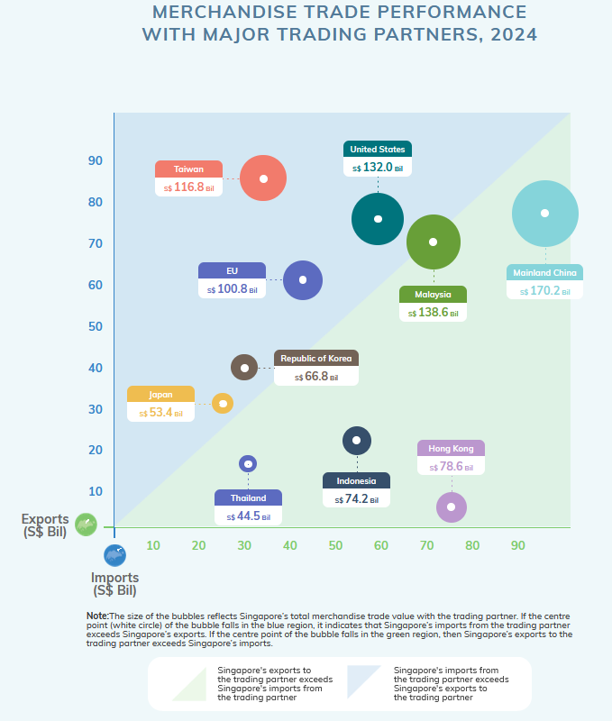

## Overview

Singapore is one of the most trade‑dependent economies in the world, consistently recording volumes of imports and exports that surpass its own Gross Domestic Product (GDP). Having harnessed international commerce as a core strategy for sustained economic growth in the current globalised economic order, despite its limited land mass, lack of natural resources and relatively small population, trade acts as the central pillar of the nation’s prosperity. With its reliance on external markets for both raw materials and finished goods, Singapore has harnessed international commerce as a core strategy for sustained economic growth.

At the heart of Singapore’s trade success lies its strategic geographic position, seated along critical shipping lanes that connect Europe, the Middle East, and the broader Asia‑Pacific region. Over the years, this advantage has helped transform the Port of Singapore into one of the busiest transshipment hubs worldwide, through which a high percentage of goods pass only to be re‑exported to other destinations. This role as a transshipment hub is partially enhanced by adding value to goods before they are moved to their final markets. By providing modern infrastructure in logistics and finance, Singapore cements its position as a preferred trade center for multinational corporations keen on tapping into Asia‑Pacific economies.

The Singapore Department of Statistics (SingStat) plays a central role in maintaining transparency and economic awareness by regularly publishing trade data and key economic indicators. Given Singapore’s heavy reliance on international commerce, timely and accurate trade statistics are essential for policymakers, businesses, and researchers alike. SingStat provides information through regularly updated datasets and infographics that summarise complex trade data.

This exercise aims to critically evaluate the effectiveness of such infographics as presented in SingStat's [website](https://www.singstat.gov.sg/modules/infographics/singapore-international-trade) in order to assess how well it conveys trends, highlights key insights, and facilitates meaningful comparisons over time., because while such visual summaries make trade statistics more accessible to the general public, they also require careful scrutiny to ensure clarity, accurate representation, and effective presentation of key metrics. In addition to this qualitative critique, we will conduct a time-series analysis of Singapore’s trade data, examining long-term patterns, fluctuations, and potential drivers behind any observed trends. By doing so, we seek to provide an assessment of how trade data is presented, analysed, and interpreted.

## Loading Data

```{r}
pacman::p_load(readxl, ggthemes, plotly, ggrepel, treemap, tidyverse, lubridate, fpp3, patchwork)
```

We will be using the [Detailed Statistical Time Series](https://www.singstat.gov.sg/find-data/search-by-theme/trade-and-investment/merchandise-trade/latest-data) data provided by SingStat, which is real data updated periodically regarding what Singapore trades and with whom.

We will mainly be working with *trade_by_region.xlsx*, which consist of monthly data from 2003-2024 of imports, exports and reexports broken down by countries which trade with Singapore. Aggregations by continent and grand totals are also available for each month

There is also a supplementary dataset *trade_by_commoditytype.xlsx*, which provides a breakdown of Singapore’s trade by commodity type, focusing on the non-oil trade. This covers a longer period, but we will only be focusing on reexport data from 2024 for analysis of a particular visualisation.

### Data Wrangling

As the data is split across different sheets with metadata in each sheet, we

(1) First extract the data by reading only the tables for each sheet, in rows 11 to 171
(2) Add on a *Trade_Type* column to differentiate between each table
(3) Merge the tables into a single data.frame

```{r}
imports <- read_excel("data/trade_by_region.xlsx", sheet = "T1", range = cell_rows(11:171))
exports <- read_excel("data/trade_by_region.xlsx", sheet = "T2", range = cell_rows(11:171))
reexports <- read_excel("data/trade_by_region.xlsx", sheet = "T3", range = cell_rows(11:171))

imports <- imports %>% mutate(Trade_Type = "Imports")
exports <- exports %>% mutate(Trade_Type = "Exports")
reexports <- reexports %>% mutate(Trade_Type = "Reexports")

trade_by_region <- bind_rows(imports, exports, reexports)
```

```{r}
reexports_commodities <- read_excel("data/trade_by_commoditytype.xlsx", sheet = "T9", range = cell_rows(11:38))
reexports_mne <- read_excel("data/trade_by_commoditytype.xlsx", sheet = "T10", range = cell_rows(11:23))
```

### Check for Missing Values

```{r}
colSums(is.na(trade_by_region)) %>%
  .[. > 0]
```

## Critique of SingStat Infographics

In this section, we will present a critique of 3 visualisations in the SingStat website mentioned earlier.

### Total Merchandise Trade At Current Prices, 2020 - 2024

In an era where trade balances and bilateral deficits have become a central political talking point — most notably during Donald Trump's presidency, which placed a strong emphasis on the balance of trade (BoT) — it is more critical than ever to ensure that trade statistics are accurately reported and correctly interpreted.

This is particularly relevant for a transshipment hub like Singapore, where trade figures can easily be misunderstood due to the inclusion of reexports in total merchandise trade as it leads to inflated perceptions of trade surpluses or deficits if included in aggregate figures. They do not reflect Singapore’s own production or domestic demand, and it appears that Singapore exports a large volume of goods to the U.S., when in reality, many of those goods are merely passing through from third-party countries.


The infographic we see simply lists "Exports", which includes reexports but does not indicate this explicitly. We will recalculate the values to introduce a separate section for reexports to make it clear,

```{r, warning=FALSE}
# Filter for "Total All Markets"
df_total <- trade_by_region %>% filter(`Data Series` == "Total All Markets")

# Identify relevant columns (years 2020-2024)
years <- c("2020", "2021", "2022", "2023", "2024")
columns <- names(df_total)[grepl(paste(years, collapse = "|"), names(df_total))]

# Convert data to long format
df_long <- df_total %>%
  select(Trade_Type, all_of(columns)) %>%
  pivot_longer(cols = -Trade_Type, names_to = "Date", values_to = "Value")

# Extract year from "Date" column
df_long$Year <- as.numeric(str_extract(df_long$Date, "\\d{4}"))
df_long$Value <- as.numeric(df_long$Value)

# Aggregate by year and Trade Type
df_summary <- df_long %>%
  group_by(Year, Trade_Type) %>%
  summarise(Total_Value = sum(Value, na.rm = TRUE))

# Reorder Trade Type so Imports appear first
df_summary$Trade_Type <- factor(df_summary$Trade_Type, levels = c("Imports", "Exports", "Reexports"))
```

```{r}
p1 <- ggplot(df_summary, aes(x = Year, y = Total_Value, fill = Trade_Type)) +
  geom_bar(stat = "identity", position = "dodge") +
  scale_y_continuous(labels = scales::comma) +
  labs(title = "Total Merchandise Trade at Current Prices (2020-2024)",
       x = "Year",
       y = "Total Value (S$ Mil)") +
  theme_minimal()

# Convert to an interactive plot with hover
ggplotly(p1, tooltip = c("x", "y", "fill"))
```

With the separation of reexports, we can now see that exports is actually less than imports, and in fact reexports is consistently more than exports.

Additionally, with the consistent use of color for each trade type, the trend over the years becomes much clearer. In particular, we can now see that there was a decline in trade activity from 2022 to 2023 — something that may not have been immediately obvious in the original infographic. This gives pause to the quoted figure of 6.6% growth in trade from 2023 to 2024, as percentages are higher when baseline values are lower.

### Merchandise Trade Performance with Major Trading Partners, 2024



This plot seems to want to illustrate the trade balance with Singapore's major trading partner by plotting exports (Y-axis) against imports (X-axis) while using bubble size to represent total trade volume. Somewhat useful, there are certain flaws with the infographic, key among which is that the plot is very sparse. While Singapore trades with circa 150 countries, only ten trading partners are represented i.e. less than 10%.

Another flaw is that the EU is treated as a single entity, while other trade regions e.g. ASEAN, NAFTA are not grouped similarly. This approach creates ambiguity, as it is unclear whether the data reflects the entirety of the EU-27 or just a subset of key trading partners. Interestingly, the infographic at the end for services specifies "EU-27", clarifying that it includes all 27 member states, but this particular one leaves room for misinterpretation. When discussing trade relationships, a more relevant classification would be the European Economic Area (EEA), as this better reflect economic integration and trade flows rather than political union.

While it is true that trade policy for the EU is centrally determined by the European Commission, this does not justify grouping all 27 member states into a single data point, especially given the vast disparities in trade volumes among them. For instance, France and Germany dominate Singapore’s trade with the EU-27, contributing a significant majority of the trade volume, while the remaining 25 countries account for a much smaller fraction. Presenting the EU as a single entity obscures these disparities.

For consistency, we will make a bubble plot with individual countries and territories according to the dataset, while having a bigger number of counries being represented on the plot.

```{r}
# Identify 2024 columns
year_2024_cols <- grep("2024", names(trade_by_region), value = TRUE)

# Exclude regional totals
exclude_keywords <- c("^Total", "^Europe$", "^Asia$", "^Oceania$", "^Africa$", "^America$")
df_filtered <- trade_by_region %>%
  filter(!grepl(paste(exclude_keywords, collapse = "|"), `Data Series`, ignore.case = TRUE))

# Sum trade values per country across 2024 months
df_filtered <- df_filtered %>%
  rowwise() %>%
  mutate(Total_Trade = sum(c_across(all_of(year_2024_cols)), na.rm = TRUE)) %>%
  ungroup()

# Pivot table: Transform trade data from long to wide format
df_pivot <- df_filtered %>%
  select(`Data Series`, Trade_Type, Total_Trade) %>%
  pivot_wider(names_from = Trade_Type, values_from = Total_Trade, values_fill = 0)

# Compute total trade volume and trade balance
df_pivot <- df_pivot %>%
  mutate(
    `Exports + Reexports` = Exports + Reexports,
    Total_Trade = Imports + Exports + Reexports,
    Trade_Balance = Exports + Reexports - Imports,
    Color = ifelse(Trade_Balance > 0, "green", "blue")
  )

# Sort by Total_Trade and pick the top 20
df_top20 <- df_pivot %>%
  arrange(desc(Total_Trade)) %>%
  slice_head(n = 20)
```

```{r, warning=FALSE}
ggplot(df_top20, aes(x = Imports, y = `Exports + Reexports`, size = Total_Trade, color = Color)) +
  geom_point(alpha = 0.6) +
  geom_text_repel(aes(label = paste(`Data Series`, "\nTotal: ", round(Total_Trade, 2))),
                  vjust = -1, size = 3, color = "black", max.overlaps = 9) +
  scale_color_manual(
    values = c("green" = "green", "blue" = "blue"),
    labels = c("Trade Surplus", "Trade Deficit"),
    name = "Trade Balance"
    ) +
  scale_size_continuous(range = c(3, 20)) +
  labs(
    title = "Merchandise Trade Performance with Top 20 Trading Partners (2024)",
    x = "Imports (S$ Mil)",
    y = "Exports + Reexports (S$ Mil)",
    size = "Total Trade Volume"
  ) +
  theme_minimal()
```

The updated visualization provides a clearer picture of the top 20 trading partners, maintaining the same top eight while revealing additional partners from America and Oceania that were previously less visible. This increased visibility highlights the broader trade relationships beyond the dominant players. Moreover, the enhanced granularity for Europe now distinctly captures Switzerland, a non-EU trading partner, alongside France. This refinement offers a more comprehensive view of trade distribution among the trading partners.

### Non-Oil Reexports by Major Commodity Sections, 2024

 The infographic presents nine broad categories, but closer inspection of the datasets reveals 36 separate categories such as Crude Rubber, Plastics in Primary Forms, Disk Drives, Consumer Electronics and Electrical Circuit Apparatus. It simplifies trade categories significantly, potentially masking key insights.

The lumping of electronics, whether big or small, and electric products into the Machinery & Transport Equipment category, consisting of 76.1% of non-oil reexports in 2024 obscures the fact that integrated circuits alone dominate reexports.

When a viewer first scrolls to the infographic, only the upper portion of the ship is visible. At this stage, the entire yellow section appears to be dedicated to Machinery & Transport Equipment, creating an illusion that the broad category tak up 100% of non-oil reexports, which is not accurate. The reality is that other major categories are still significant but are visually hidden until the user scrolls further.

To address this, we will create a treemap to provide a more accurate and proportional breakdown of Singapore’s non-oil reexports. The treemap will highlight the relative share of each category, ensuring that smaller but significant sectors are not visually overshadowed by the dominance of electronics.

We have to make use of *trade_by_commoditytype.xlsx* here

```{r}
year_2024_cols <- grep("2024", names(reexports_commodities), value = TRUE)

# Sum across all 2024 months for T9 (detailed commodities)
reexports_commodities <- reexports_commodities %>%
  mutate(Trade_Value = rowSums(select(., all_of(year_2024_cols)), na.rm = TRUE)) %>%
  select(`Data Series`, Trade_Value) %>%
  mutate(Source = "Detailed Commodities")

# Sum across all 2024 months for T10 (major categories)
reexports_mne <- reexports_mne %>%
  mutate(Trade_Value = rowSums(select(., all_of(year_2024_cols)), na.rm = TRUE)) %>%
  select(`Data Series`, Trade_Value) %>%
  mutate(Source = "Machinery & Equipment")

# Remove total rows from T10
reexports_mne <- reexports_mne %>%
  filter(!grepl("Total", `Data Series`, ignore.case = TRUE))

reexports_nonoil <- bind_rows(reexports_mne, reexports_commodities)
```

```{r}
treemap(
  reexports_nonoil,
  index = c("Source", "Data Series"),
  vSize = "Trade_Value",
  title = "Singapore Non-Oil Reexports (2024)",
  palette = "Set3",
  border.col = "white"
)
```

This treemap provides a clear visualization of Singapore’s non-oil reexports in 2024, where the size of each rectangle corresponds to the total reexport value, where larger sections represent higher trade volumes. However, it is important to note that this visualization presents only one level of data, meaning there is no hierarchy between categories. Each box exists independently, and there is no grouping of related items.Although the treemap features shades of yellow and blue, these colors do not carry any specific meaning.They are simply used to improve readability.

It is immediately clear that Integrated Circuits account for the largest share of reexports, reinforcing Singapore’s role as a major hub for electronics trade. While Non-Electronic Products take up a much smaller space, smaller but notable categories such as Professional & Scientific Instruments, Pharmaceuticals, Organic Chemicals, and Beverages are now clearly represented instead of being lumped under fuzzy categories. It is easier to see that Singapore’s reexports are more diverse than what was previously implied.

## Time Series Analysis

We will analyse the 3 time series data of Singapore's total trade: imports, exports, reexports. In order to do that we will have to process the data and convert the strings into monthly date format. Then, we will get three diffferent series for imports, exports, reexports to be converted into a tsibble.

```{r}
total_markets <- trade_by_region %>%
  filter(`Data Series` == "Total All Markets") %>%
  select(-`Data Series`) %>%
  pivot_longer(cols = -Trade_Type, names_to = "Month", values_to = "Trade_Value") %>%
  mutate(Month = yearmonth(parse_date_time(Month, "Y b"))) 

# Split into three separate tsibbles
imports_ts <- total_markets %>%
  filter(Trade_Type == "Imports") %>%
  select(-Trade_Type) %>%
  as_tsibble(index = Month)

exports_ts <- total_markets %>%
  filter(Trade_Type == "Exports") %>%
  select(-Trade_Type) %>%
  as_tsibble(index = Month)

reexports_ts <- total_markets %>%
  filter(Trade_Type == "Reexports") %>%
  select(-Trade_Type) %>%
  as_tsibble(index = Month)

```

Define a function to plot the time series data together with the autocorrelation function ACF and partial autocorrelation function to analyse the data

```{r}
plot_ts <- function(ydat, y, trade_type){

   # Function to plot time series with
   # ACF and PACF
  
   p1 <- ydat %>% autoplot({{y}}) + theme_minimal() + labs(title = paste("Trade Type:", trade_type), x="") +
     theme(axis.title.y=element_text(size=9, angle=0, vjust=0.5),
           axis.text=element_text(size=6, angle=0, vjust=0.5))
   p2 <- ydat %>% ACF({{y}},lag_max=35) %>% autoplot() + 
     theme_minimal() + ylim(-1,1) + xlab("ACF") + ylab("") +
     theme(axis.title.y=element_text(size=9, angle=0, vjust=0.5),
           axis.text=element_text(size=9, angle=0, vjust=0.5))
   p3 <- ydat %>% PACF({{y}}, lag_max=36) %>% autoplot() + 
     theme_minimal() + ylim(-1,1) + xlab("PACF") + ylab("") +
     theme(axis.title.y=element_text(size=9, angle=0, vjust=0.5),
           axis.text=element_text(size=9, angle=0, vjust=0.5))
   p1 / (p2 | p3)
}
```

### Monthly Imports Time Series Analysis

```{r}
plot_ts(imports_ts, Trade_Value, "Imports")
```
The ACF plot exhibits a slowly decaying pattern, which is characteristic of an autoregressive (AR) process. In an AR model, past values influence future values, leading to this gradual decline in autocorrelation over time.

However, the PACF does not show a clear cutoff after a few lags, which would typically confirm an AR(p) process. Instead, the PACF exhibits multiple significant lags, especially at lags of 12 and 13, which could indicate the presence of yearly seasonality in the data. This suggests that a simple AR model may not fully capture the underlying structure.

We try to fit an ARIMA model (with seasonality) using the Akaike Information Criterion (AIC) and Bayesian Information Criterion (BIC), which are model fitting methods that picks the model with the highest log-likelihood, but with regularisation involved. This prevents the model from getting too complex, and BIC has a heavier penalty for more complex models compared to AIC.

```{r}
mdls <- imports_ts %>%
  model(
    search_bic = ARIMA(Trade_Value, ic="bic"),
    search_aic = ARIMA(Trade_Value, ic="aic")
  )
mdls %>% select(search_aic) %>% report()
mdls %>% select(search_bic) %>% report()
```
Based on the fitted models, the first difference predicted by both models ARIMA(p,1,q) implies that the imports series has a clear upward trend, and can only be transformed into a stationary series by one level of differencing.

The Moving Average (MA) term in ARIMA(p,d,1) means that the differenced series follows an MA(1) process. This means that random shocks from a previous time step influences the current residual (shock) term, but no other shocks affect the current residual. 

The seasonal MA term (P,D,2)[12] and (P,D,1)[12] predicted by the AIC and BIC respectively means that a seasonal shock one year ago (t-12) (and two years ago (t-24)) influences the current import total.

Using the BIC fitted models, we can then forecast the import trade values 1 step ahead and 12 steps ahead (from seasonality) and visualise the forecasts.

```{r}
forecast_1_step <- mdls %>%
  forecast(h = 1)

autoplot(forecast_1_step, imports_ts, level = NULL) +
  labs(title = "1-Step Import Forecast", x = "Month", y = "Trade Value") +
  theme_minimal()
```

```{r}
forecast_12_step <- mdls %>%
  forecast(h = 12)

autoplot(forecast_12_step, imports_ts, level = NULL) +
  labs(title = "12-Step Import Forecast", x = "Month", y = "Trade Value") +
  theme_minimal()
```

### Monthly Exports Time Series Analysis

We repeat the steps above for Export Data, and emphasize model selection and the forecasts

```{r}
plot_ts(exports_ts, Trade_Value, "Exports")
```

```{r}
mdls <- exports_ts %>%
  model(
    search_bic = ARIMA(Trade_Value, ic="bic"),
    search_aic = ARIMA(Trade_Value, ic="aic")
  )
mdls %>% select(search_aic) %>% report()
mdls %>% select(search_bic) %>% report()
```
We get the same model, but now the seasonal MA process is emphasized as seasonal MA(2) from both models, i.e. the seasonal process works at lags of 12 months and 24 months.

```{r}
forecast_1_step <- mdls %>%
  forecast(h = 1)

autoplot(forecast_1_step, exports_ts, level = NULL) +
  labs(title = "1-Step Export Forecast", x = "Month", y = "Trade Value") +
  theme_minimal()
```
```{r}
forecast_12_step <- mdls %>%
  forecast(h = 12)

autoplot(forecast_12_step, exports_ts, level = NULL) +
  labs(title = "12-Step Export Forecast", x = "Month", y = "Trade Value") +
  theme_minimal()
```
### Monthly Reexports Time Series Analysis
We repeat the steps above for Reexport Data, and emphasize model selection and the forecasts again.

```{r}
plot_ts(reexports_ts, Trade_Value, "Reexports")
```

```{r}
mdls <- reexports_ts %>%
  model(
    search_bic = ARIMA(Trade_Value, ic="bic"),
    search_aic = ARIMA(Trade_Value, ic="aic")
  )
mdls %>% select(search_aic) %>% report()
mdls %>% select(search_bic) %>% report()
```
```{r}
forecast_1_step <- mdls %>%
  forecast(h = 1)

autoplot(forecast_1_step, reexports_ts, level = NULL) +
  labs(title = "1-Step Export Forecast", x = "Month", y = "Trade Value") +
  theme_minimal()
```
```{r}
forecast_12_step <- mdls %>%
  forecast(h = 12)

autoplot(forecast_12_step, reexports_ts, level = NULL) +
  labs(title = "12-Step Export Forecast", x = "Month", y = "Trade Value") +
  theme_minimal()
```
### Summary of Time Series Results

The trade processes for imports, exports, and reexports all follow the same statistical model ARIMA(0,1,1)(0,0,2)[12]. This consistency suggests that the various components of trade are influenced by similar underlying economic forces.

The first-order differencing (d=1) indicates a clear trend in all three trade categories, meaning that trade values are not stationary and likely exhibit long-term growth.

The moving average component MA(1) implies that short-term shocks, such as policy changes, supply chain disruptions, or external market fluctuations, have a lingering effect on trade values. The presence of two seasonal moving average components SMA(2) highlights that trade activities are strongly influenced by seasonal patterns, with the effects of past shocks persisting for up to two years.

From an economic perspective, this uniformity across imports, exports, and re-exports is a positive sign. It suggests that trade dynamics are predictable and stable, indicating that trade policies, production capabilities, and market conditions are well-aligned, fostering a balanced trade environment.

## Conclusion

The analysis of Singapore’s trade data reveals a remarkable consistency across imports, exports, and reexports. This suggests that the key components of Singapore’s trade operate under similar economic conditions and are driven by common underlying factors. Its trade landscape exhibits both resilience and systematic structure, reinforcing its position as a key player in global commerce.

This exercise highlights the importance of clarity, accuracy, and transparency in the presentation of trade data, particularly in a trade-dependent economy like Singapore. While SingStat’s infographics serve as an important tool for making trade statistics accessible, our analysis has identified several areas where improvements could enhance their effectiveness.
