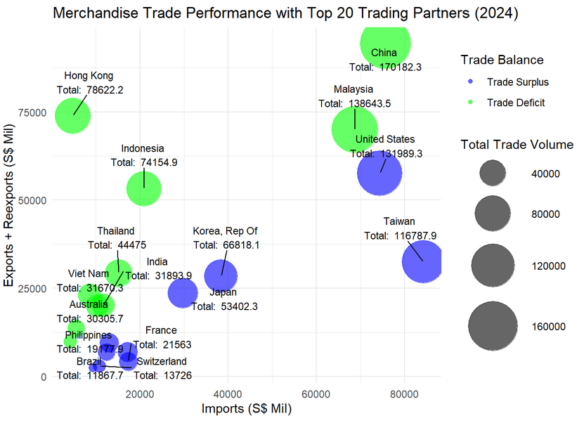
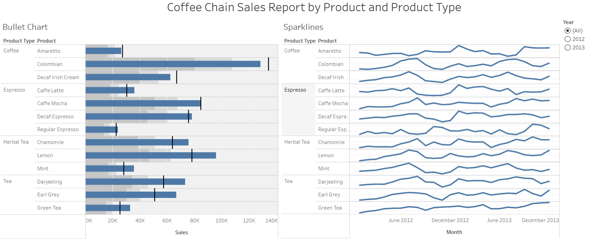
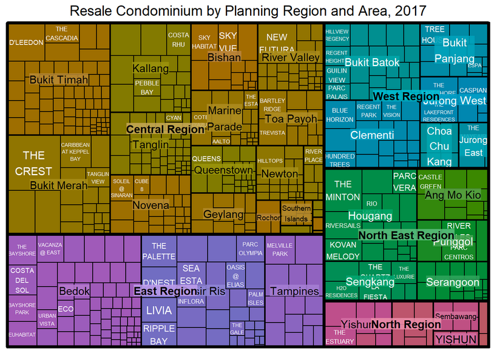

---
format:
  html:
    toc: false
    title-block: false
---

Welcome to this little snippet of my **ISSS608 Visual Analytics and Applications** journey. This website details the ups and downs of my journey with R, and some links to my use of the incredible visualization program that is Tableau.

------------------------------------------------------------------------

### Highlights:

```{=html}
<div class="row row-cols-3 g-4">

  <div class="col">
    <div class="card h-100">
      
      <div class="card-body">
        <h5 class="card-title">Take Home Exercise 2:<br>Singapore’s Balance of Trade in Goods</h5>
        <p class="card-text">Singapore is one of the most trade‑dependent economies in the world, consistently recording volumes of imports and exports that surpass its own Gross Domestic Product (GDP). Having harnessed international commerce as a core strategy for sustained economic growth in the current globalised economic order, despite its limited land mass, lack of natural resources and relatively small population, trade acts as the central pillar of the nation’s prosperity. With its reliance on external markets for both raw materials and finished goods, Singapore has harnessed international commerce as a core strategy for sustained economic growth.</p>
        <a href="Take_Home_Exercises/THE_02/THE_02.html" class="btn btn-primary">Read More</a>
      </div>
    </div>
  </div>

  <div class="col">
    <div class="card h-100">
      
      <div class="card-body">
        <h5 class="card-title">In Class Exercise 10<br>Bullet Graph and Sparklines</h5>
        <p class="card-text">Explore structured data visualised using Tableau features.</p>
        <a href="https://public.tableau.com/app/profile/junyit.yee/viz/InClassExercise_10/CoffeeChainSalesReportbyProductandProductType" class="btn btn-primary">See More</a>
      </div>
    </div>
  </div>

  <div class="col">
    <div class="card h-100">
      
      <div class="card-body">
        <h5 class="card-title">Hands-on Exercise 5e:<br>Treemaps</h5>
        <p class="card-text">In this exercise, we will be designing treemaps using the appropriate R packages. There will be three sections to the exercise:</p>

<p>First, we will manipulate transaction data into a treemap structure by using selected functions provided in the dplyr package. Second, we will plot static treemaps by using the treemap package. Third, we will design an interactive treemap by using the d3treeR package.</p>
        <a href="Hands_On_Exercises/HOE05/HOE_05e.html" class="btn btn-primary">Read More</a>
      </div>
    </div>
  </div>

</div>
```
